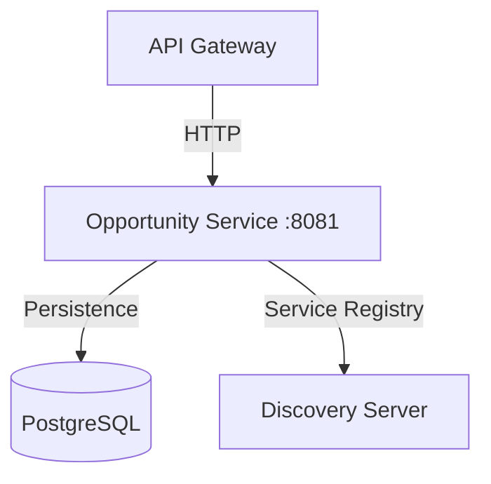

# System Context: Opportunity Service

The **TechConnect Opportunity Service** is a domain-specific microservice responsible for the lifecycle of professional opportunities.

## Architectural Role

This service serves as the system of record for all "Opportunities" (Hackathons, Certifications, and Promos). It is a downstream service that is abstracted from the end-user by the API Gateway.

## Internal & External Flow

1. **Service Registration**: Upon startup, the Opportunity Service registers itself with the Discovery Server (Eureka) as `opportunity-service`.
2. **Request Processing**: It receives requests from the API Gateway (or other internal services).
3. **Business Logic**: It validates domain constraints (e.g., `endDate` must be after `startDate`).
4. **Data Persistence**: It stores and retrieves data from a PostgreSQL database using JPA/Hibernate.

## Key Interactions

- **Discovery Server**: Used for service registration and discovery.
- **API Gateway**: Sends authenticated requests to this service.
- **PostgreSQL**: Stores the persistent state of all opportunities.
